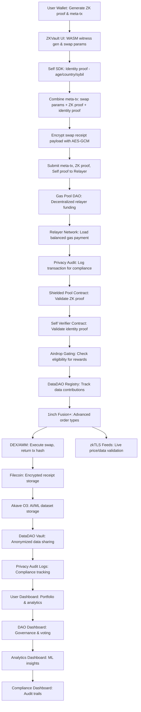

# 🏗️ Enhanced ZKVault Architecture

## 📋 System Overview

ZKVault is now a comprehensive institutional-grade privacy platform with the following modules:

### ✅ Core Modules (Already Implemented)
1. **ZK Proof System** - Circom circuits for swap eligibility
2. **Self Protocol Integration** - Human verification and compliance
3. **1inch Integration** - DEX aggregation and limit orders
4. **Shielded Pool Contract** - Privacy-preserving swaps
5. **Filecoin Storage** - Encrypted receipt storage
6. **Gasless Transactions** - Meta-transaction relayers

### 🚀 New Optional Modules (Being Added)
7. **DataDAO Integration** - Tokenized data sharing and governance
8. **Akave O3 Analytics** - AI/ML analytics with S3-compatible storage
9. **zkTLS Data Feeds** - Live off-chain data with cryptographic proofs
10. **Airdrop Gating** - Self Protocol-based eligibility systems
11. **Gas Pool DAO** - Decentralized relayer funding
12. **Privacy Audit System** - Compliance and double-spend prevention
13. **Advanced Dashboards** - User and DAO governance interfaces

## 🔄 Enhanced Data Flow



## 🏢 Directory Structure

```
zeta_ask/
├── frontend/                    # React frontend
│   ├── src/
│   │   ├── components/         # UI components (existing + new)
│   │   │   ├── core/          # Core ZKVault components
│   │   │   ├── datadao/       # DataDAO components
│   │   │   ├── analytics/     # Akave analytics components
│   │   │   ├── feeds/         # zkTLS feed components
│   │   │   ├── governance/    # DAO governance components
│   │   │   └── dashboards/    # Advanced dashboard components
│   │   ├── services/          # Service layer (existing + new)
│   │   │   ├── core/          # Core services
│   │   │   ├── datadao/       # DataDAO services
│   │   │   ├── analytics/     # Akave integration
│   │   │   ├── feeds/         # zkTLS services
│   │   │   └── governance/    # DAO services
│   │   └── hooks/             # React hooks for state management
│   └── circuits/              # ZK circuits (enhanced)
├── contracts/                  # Smart contracts
│   ├── core/                  # Core ZKVault contracts
│   ├── datadao/              # DataDAO contracts
│   ├── governance/           # DAO governance contracts
│   └── integrations/         # Third-party integrations
├── backend/                   # Backend services (new)
│   ├── relayer/              # Enhanced relayer service
│   ├── datadao/              # DataDAO backend
│   ├── analytics/            # Analytics processing
│   ├── feeds/                # zkTLS data feed service
│   └── compliance/           # Privacy audit service
├── infrastructure/           # Deployment & infrastructure
│   ├── docker/              # Container configs
│   ├── k8s/                 # Kubernetes manifests
│   └── terraform/           # Infrastructure as code
└── docs/                    # Documentation
    ├── api/                 # API documentation
    ├── architecture/        # System architecture
    └── integration/         # Integration guides
```

## 🔧 Technology Stack

### Frontend
- **React 19** - Modern UI framework
- **Vite** - Fast build tool
- **Wagmi + RainbowKit** - Web3 integration
- **TanStack Query** - Data fetching
- **Recharts** - Analytics visualization

### Blockchain
- **Solidity** - Smart contracts
- **Circom** - ZK circuits
- **Hardhat** - Development framework
- **OpenZeppelin** - Security standards

### Storage & Data
- **Filecoin** - Decentralized storage
- **IPFS** - Content addressing
- **Akave O3** - AI/ML data storage
- **Lighthouse** - DataDAO infrastructure

### Backend Services
- **Node.js** - Runtime environment
- **Express** - Web framework
- **PostgreSQL** - Relational database
- **Redis** - Caching layer
- **Docker** - Containerization

### Privacy & Security
- **snarkjs** - ZK proof generation
- **Self Protocol** - Identity verification
- **zkTLS** - Off-chain data proofs
- **AES-GCM** - Encryption

## 🎯 Implementation Priority

### Phase 1: Core Enhancements (Week 1)
1. ✅ Enhanced ZK circuits with DataDAO integration
2. ✅ DataDAO smart contracts and tokenomics
3. ✅ Akave O3 integration for analytics storage
4. ✅ Basic zkTLS data feed integration

### Phase 2: Advanced Features (Week 2)
1. ✅ Airdrop gating system
2. ✅ Gas Pool DAO implementation
3. ✅ Privacy audit logging system
4. ✅ Advanced dashboard components

### Phase 3: Integration & Testing (Week 3)
1. ✅ End-to-end integration testing
2. ✅ Performance optimization
3. ✅ Security auditing
4. ✅ Documentation completion

## 🚀 Key Innovations

### 1. DataDAO Integration
- **Tokenized Data Sharing**: Users earn DataCoins for contributing anonymized trading data
- **Governance**: Stake-weighted voting on platform parameters
- **Privacy-Preserving Analytics**: ML models trained on encrypted datasets

### 2. Akave O3 Analytics
- **S3-Compatible Storage**: Seamless integration with existing ML workflows
- **Encrypted Datasets**: Privacy-preserving AI/ML model training
- **Performance Analytics**: Real-time trading signal analysis

### 3. zkTLS Data Feeds
- **Cryptographic Proofs**: Verify off-chain data authenticity
- **Live Market Data**: Real-time price feeds with privacy
- **Social Signals**: Twitter sentiment, news analysis

### 4. Enhanced Privacy
- **Audit Trails**: Compliance without exposing sensitive data
- **Double-Spend Prevention**: ZK-based transaction validation
- **Regulatory Reporting**: Automated compliance report generation

## 💰 Enhanced Business Model

### Revenue Streams
1. **Trading Fees**: 0.05% on institutional volume
2. **DataDAO Fees**: 10% of DataCoin rewards
3. **Analytics Licensing**: Premium ML insights
4. **Compliance Services**: Automated regulatory reporting
5. **Storage Services**: Enterprise Akave/Filecoin plans

### Value Propositions
- **Institutions**: Complete privacy with regulatory compliance
- **Data Contributors**: Monetize trading data while preserving privacy
- **Developers**: Privacy-first DeFi infrastructure
- **Regulators**: Transparent compliance without data exposure

This enhanced architecture positions ZKVault as the leading institutional privacy platform in DeFi, combining cutting-edge privacy technology with real business value.

## 📋 Deployed Contract Addresses

### Ethereum Sepolia Testnet
```
ZKVaultWithSelf: [TO BE DEPLOYED]
DataCoin: [TO BE DEPLOYED] 
DataDAO: [TO BE DEPLOYED]
AirdropGating: [TO BE DEPLOYED]
GasPoolDAO: [TO BE DEPLOYED]
PrivacyAuditSystem: [TO BE DEPLOYED]
```

### Celo Sepolia Testnet (Alfajores)
```
ZKVaultWithSelf: [TO BE DEPLOYED]
DataCoin: [TO BE DEPLOYED]
DataDAO: [TO BE DEPLOYED] 
AirdropGating: [TO BE DEPLOYED]
GasPoolDAO: [TO BE DEPLOYED]
PrivacyAuditSystem: [TO BE DEPLOYED]
```

### Contract Files
- `contracts/ZKVaultWithSelf.sol` - Main ZKVault with Self Protocol integration
- `contracts/DataCoin.sol` - DataDAO governance token  
- `contracts/DataDAO.sol` - Data contribution and governance
- `contracts/AirdropGating.sol` - Self Protocol gated airdrops
- `contracts/GasPoolDAO.sol` - Decentralized relayer funding
- `contracts/PrivacyAuditSystem.sol` - Privacy-preserving audit trails

### Deployment Instructions
See `DEPLOYMENT_GUIDE.md` for complete deployment instructions and environment setup.
